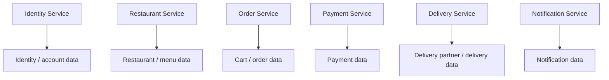

# Orderly Database Architecture

## 1. Purpose

Orderly uses domain-owned persistent data.

The central rule is:

> A service owns its data and other services do not directly access its database tables.

This keeps domain boundaries explicit and reduces coupling.

## 2. Data Ownership Model



The exact schema and table names are defined by each service's Prisma schema and migrations.

## 3. Identity Data

The Identity domain owns information required to authenticate and authorize normal application users.

Typical concepts include:

- User/account identity
- Email
- Password hash
- Role
- Account status
- Authentication metadata

Supported roles:

```text
CUSTOMER
RESTAURANT
DELIVERY_PARTNER
```

Admin authentication is separate.

Passwords must never be stored in plaintext.

## 4. Restaurant Data

Restaurant service owns:

- Restaurant profiles
- Restaurant status
- Restaurant availability
- Menu categories
- Menu items
- Menu pricing
- Restaurant-related feedback visibility

Other services should request restaurant information through APIs or approved event contracts.

## 5. Order Data

Order service owns:

- Cart/order state where applicable
- Orders
- Order items
- Order lifecycle
- Pricing snapshot/authoritative order totals
- Discounts/coupon application data
- Order history

An order must preserve the relevant pricing used at the time the order was created.

## 6. Payment Data

Payment service owns:

- Payment records
- Provider references
- Payment method
- Payment status
- Verification information
- Payment failure state

Payment records should reference the relevant order through a stable identifier rather than creating direct database coupling to the Order service.

## 7. Delivery Data

Delivery service owns:

- Delivery partner profile/state
- Approval state
- Online/offline state
- Assignment
- Pickup state
- Delivery state
- Location/movement information where implemented

A delivery partner must be approved before accepting delivery work.

## 8. Notification Data

Notification service owns notification records and delivery-related state where persistence is required.

Notifications may be generated from domain events such as:

- New registration
- Order status change
- Payment state change
- Delivery assignment
- Feedback
- Delivery completion

## 9. Cross-Service References

A service may store another domain's identifier when needed.

Example:

```text
Order
 ├── customerId
 ├── restaurantId
 └── deliveryPartnerId
```

These identifiers do not create permission to query the foreign service's tables directly.

The owning service remains authoritative for the referenced entity.

## 10. Database Migrations

Database schema changes must be performed through the project's migration system.

Rules:

- Do not manually edit production schema without a controlled migration.
- Keep migrations versioned.
- Review destructive migrations carefully.
- Test migrations before deployment.
- Do not delete existing migrations merely to make a local database convenient.
- Preserve migration history in version control.

## 11. Data Integrity

Important invariants include:

- An order must have valid order items.
- Payment state must correspond to a valid payment record.
- Delivery assignment must reference a valid delivery partner identity.
- Feedback must be associated with a delivered order.
- One delivered order must not produce duplicate feedback records.
- Account status must be respected by protected operations.

## 12. Pricing Integrity

The database must preserve the authoritative final order amount.

The frontend must never be the source of truth for:

- Subtotal
- Discount
- Tax
- Delivery fee
- Platform fee
- Final payable amount

The server recalculates/validates these values before creating the order and payment.

## 13. Transactions

Use database transactions when multiple writes must succeed or fail together.

Examples:

- Creating an order and its order items
- Updating payment state with dependent order state
- Applying an operation that requires multiple related records

Do not use transactions as a substitute for cross-service distributed transactions. Cross-service workflows should use APIs/events and explicit state handling.

## 14. No Shared Database Rule

Do not introduce a generic shared database layer that allows every service to query every domain.

Avoid:

```text
Order Service ──────► Restaurant DB
Payment Service ────► Order DB
Delivery Service ───► User DB
```

Prefer:

```text
Order Service ──API/Event──► Restaurant Service
Payment Service ─API/Event─► Order Service
Delivery Service ─API/Event► Identity/Order
```

## 15. Backups and Recovery

Production database operations should include:

- Scheduled backups
- Tested restoration procedures
- Migration backups where appropriate
- Access control
- Encrypted transport
- Restricted credentials

Recovery procedures must be documented before production deployment.

## 16. Source of Truth

When documentation and implementation differ, verify the actual Prisma schema, migrations, service code, and contracts before changing the documentation.

This document describes the architectural ownership model; it does not replace the actual migration/schema files.
