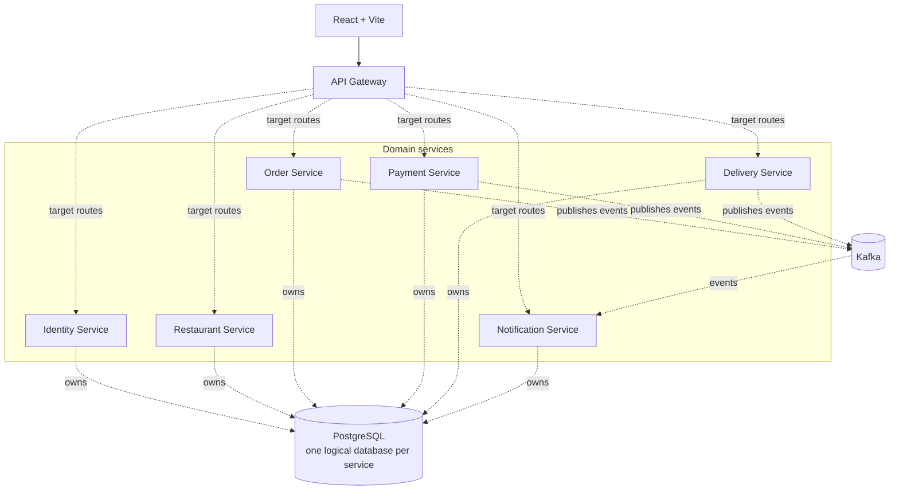
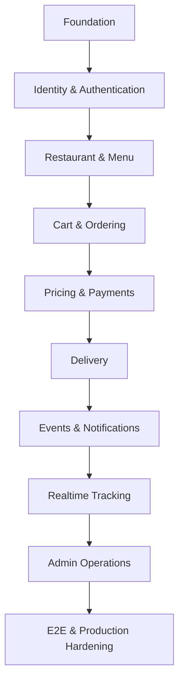

# Orderly

<p align="center">
  
</p>

Real-time food delivery platform built with React, TypeScript, domain-focused services, Kafka, PostgreSQL, and realtime updates.

[](https://www.typescriptlang.org/)
[](https://react.dev/)
[](https://nodejs.org/)
[](https://pnpm.io/)
[](https://turborepo.com/)
[](https://github.com/rajesh-kayal-dev/orderly/actions/workflows/ci.yml)
[](LICENSE)

**Explore:** [Overview](#what-is-orderly) ·
[Product Roles](#product-roles) ·
[Order Journey](#order-journey) ·
[Architecture](#architecture) ·
[Local Development](#local-development) ·
[Testing](#testing) ·
[Documentation](#documentation)

## What is Orderly?

Orderly is a food-delivery platform for customers, restaurants, delivery partners, and administrators. It supports restaurant discovery, menu browsing, cart and checkout, payment or cash on delivery, order tracking, delivery management, and feedback.

The codebase is a multi-service application organized around explicit domain ownership. Synchronous APIs, an event-driven architecture, and realtime order and delivery updates are being integrated incrementally as the platform converges toward its target service boundaries.

## Product Roles

| Role | Main capabilities |
| --- | --- |
| Customer | Discover restaurants and menus, manage a cart, check out, pay or use COD, track orders, view history, and submit feedback. |
| Restaurant | Manage a profile and menus, receive and process orders, update preparation state, and view feedback. |
| Delivery Partner | Maintain approval and availability, accept deliveries, update pickup and transit state, complete deliveries, and view delivery history. |
| Admin | Manage customers, restaurants, delivery partners, orders, feedback, and operational notifications. |

## Order Journey

```mermaid
flowchart LR
    A["Customer"] --> B["Restaurant & Menu"]
    B --> C["Cart"]
    C --> D["Checkout"]
    D --> E["Payment / COD"]
    E --> F["Order Placed"]
    F --> G["Restaurant Accepts"]
    G --> H["Preparing"]
    H --> I["Ready"]
    I --> J["Delivery Assigned"]
    J --> K["Picked Up"]
    K --> L["In Transit"]
    L --> M["Delivered"]
    M --> N["Feedback"]
```



## Architecture

The target topology routes frontend traffic through the API Gateway to domain-owned services. The current implementation is still converging toward those boundaries.



Each domain service owns its persistence and business logic. Services communicate through APIs and events rather than directly querying another service's database. The PostgreSQL node represents one physical cluster with a separate logical database per service, not unrestricted shared access.

Kafka is currently wired for Order, Payment, and Delivery producers and for the Notification consumer. The Gateway also retains transitional business logic and direct persistence; dashed Gateway routes show the intended service boundaries.

### Architecture explanation

| Layer | Responsibility |
| --- | --- |
| Frontend | Customer, restaurant, delivery-partner, and admin interfaces |
| Gateway | Target public API boundary, authentication enforcement, and request routing |
| Domain services | Business ownership by domain |
| Kafka | Event contracts and current producer/consumer communication |
| PostgreSQL | One physical cluster with service-owned logical databases |
| Shared packages | API/event contracts, Kafka utilities, and neutral shared utilities |

See [ARCHITECTURE.md](ARCHITECTURE.md), [API.md](API.md), [DATABASE.md](DATABASE.md), and [EVENTS.md](EVENTS.md) for detailed design notes.

## Engineering Highlights

| Area | Highlights |
| --- | --- |
| Architecture | TypeScript monorepo, pnpm workspaces, Turborepo, API Gateway, and domain-focused services |
| Communication | REST APIs, Kafka event contracts, Socket.IO updates, and incremental event integration |
| Data | PostgreSQL, Prisma, and service-owned persistence boundaries |
| Security | JWT authentication, role-based access, password hashing, and account-status enforcement |
| Payments | Payment-provider integration, cash on delivery, and server-authoritative pricing |
| Testing | Node service tests, frontend lint/typecheck, builds, and Playwright E2E |

## Development Roadmap



Orderly is being developed incrementally by domain, with each stage building on the previous platform capabilities. The roadmap shows the intended sequence, not completion percentages or status.

## Repository Structure

```text
orderly/
├── .github/
├── apps/
│   ├── frontend/
│   ├── gateway/
│   └── e2e/
├── services/
│   ├── identity/
│   ├── restaurant/
│   ├── order/
│   ├── payment/
│   ├── delivery/
│   └── notification/
├── packages/
│   ├── contracts/
│   ├── events/
│   └── utils/
├── infra/
├── infrastructure/
│   └── postgres/
├── docs/
│   ├── adr/
│   └── runbooks/
└── scripts/
```

Generated directories such as `node_modules`, `dist`, `.turbo`, generated Prisma clients, and Playwright artifacts are intentionally omitted.

## Technology Stack

| Area | Technologies |
| --- | --- |
| Frontend | React, TypeScript, Vite, Tailwind CSS, React Router |
| Backend | Node.js, TypeScript, Express |
| APIs | REST and a centralized API Gateway |
| Data | PostgreSQL and Prisma |
| Messaging | Apache Kafka |
| Realtime | Socket.IO |
| Infrastructure | Docker Compose, Turborepo, and pnpm workspaces |
| Testing | Node test runner, ESLint, and Playwright |

## Local Development

> **Local setup note:** The checked-in infrastructure and migration files are still being reconciled. The sequence below uses the service-owned PostgreSQL configuration and starts Kafka separately.

### Prerequisites

- Git
- Node.js 22.x, matching CI
- pnpm 10.33.0
- Docker with Docker Compose

### Install

```bash
git clone https://github.com/rajesh-kayal-dev/orderly.git
cd orderly
pnpm install --frozen-lockfile
```

### Configure environment

Create local `.env` files from `.env.example`, `apps/frontend/.env.example`, and the relevant `services/*/.env.example` files. A root `.env` does not replace service-specific environment files.

For services that publish or consume Kafka events, configure `KAFKA_BROKERS=localhost:9092`. Keep all real credentials local and never commit `.env` files.

### Start infrastructure

Start the service-owned PostgreSQL configuration and the Kafka service from the combined infrastructure file:

```bash
docker compose -f infrastructure/postgres/docker-compose.yml up -d
docker compose -f infra/docker-compose.yml up -d kafka
```

The PostgreSQL Compose file creates only the `orderly` database. The repository does not currently automate creation of the remaining logical databases:

```bash
docker exec -it orderly-postgres createdb -U orderly orderly_restaurant
docker exec -it orderly-postgres createdb -U orderly orderly_order
docker exec -it orderly-postgres createdb -U orderly orderly_payment
docker exec -it orderly-postgres createdb -U orderly orderly_delivery
docker exec -it orderly-postgres createdb -U orderly orderly_notification
```

### Generate clients and build

Prisma clients are generated by the service build scripts:

```bash
pnpm build
```

The repository has no complete root migration workflow, and the current migration history is incomplete for some services. Review [DATABASE.md](DATABASE.md) and resolve service migrations before relying on an existing database.

### Start Orderly

```bash
pnpm dev
```

## Testing

Run the verified repository checks from the repository root:

```bash
pnpm lint
pnpm typecheck
pnpm test
pnpm build
```

`pnpm lint` and `pnpm typecheck` currently run frontend workspace tasks; `pnpm build` compiles all TypeScript workspaces. The root `pnpm test` task includes service, shared-package, and E2E workspaces.

With Orderly running, required test data available, and Chromium installed, run the browser suite directly with:

```bash
pnpm --filter @orderly/e2e test
```

Golden Order flow: Customer → Restaurant → Payment/COD → Delivery → Delivered → Feedback.

## Documentation

| Document | Purpose |
| --- | --- |
| [ARCHITECTURE.md](ARCHITECTURE.md) | System structure, service boundaries, and communication patterns |
| [API.md](API.md) | API communication and Gateway responsibilities |
| [DATABASE.md](DATABASE.md) | Data ownership and Prisma guidance |
| [EVENTS.md](EVENTS.md) | Kafka topics and asynchronous communication |
| [DEPLOYMENT.md](DEPLOYMENT.md) | Deployment and operational guidance |
| [SECURITY.md](SECURITY.md) | Security practices and vulnerability reporting |
| [COLLABORATION.md](COLLABORATION.md), [CONTRIBUTING.md](CONTRIBUTING.md) | Collaboration and contribution workflow |
| [CHANGELOG.md](CHANGELOG.md) | Project change history |
| [LICENSE](LICENSE) | Project license |

Architecture decisions: [docs/adr/](docs/adr/). Operational procedures: [docs/runbooks/](docs/runbooks/).

## Project Status

**Active development / pre-deployment hardening.** The implementation is still being reconciled with the target service boundaries, infrastructure topology, and deployment model.

## License

Orderly is distributed under the project's proprietary license.

See [LICENSE](LICENSE) for details.
